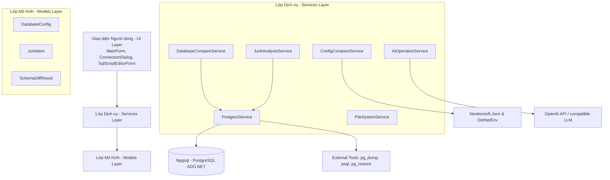
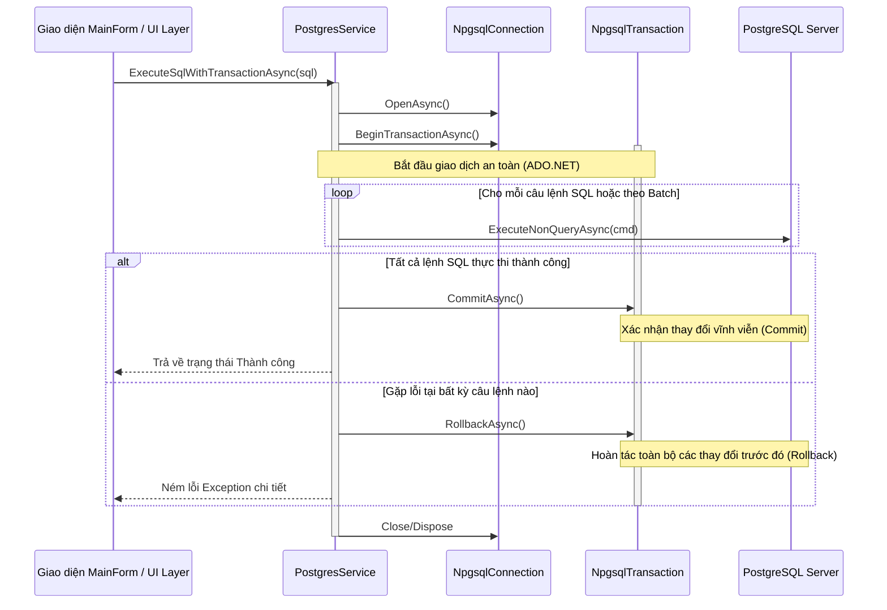

# TÀI LIỆU KIẾN TRÚC KỸ THUẬT CHI TIẾT (TECHNICAL ARCHITECTURE)
## Dự án: ReleasePrepTool (Release Version)

Tài liệu này cung cấp cái nhìn toàn diện về mặt kiến trúc phần mềm, thiết kế các dịch vụ cốt lõi, luồng xử lý đồng bộ giao dịch và thiết kế hệ thống giao diện người dùng của ứng dụng **ReleasePrepTool**. Đây là công cụ hỗ trợ chuẩn bị phiên bản phần mềm chuyên nghiệp, thực hiện các tác vụ so sánh & đồng bộ cơ sở dữ liệu (PostgreSQL), quét dọn dữ liệu rác, so sánh cấu hình và kiểm duyệt kịch bản phát hành bằng trí tuệ nhân tạo (AI Review).

---

## 1. Tổng quan Kiến trúc Hệ thống (System Architecture Overview)

Ứng dụng **ReleasePrepTool** được phát triển trên nền tảng .NET sử dụng mô hình Windows Forms hiện đại. Kiến trúc hệ thống tuân thủ nguyên lý phân lớp (Layered Architecture) rõ ràng, giúp phân tách các mối quan tâm (Separation of Concerns) và nâng cao khả năng bảo trì, mở rộng mã nguồn.

### Sơ đồ cấu trúc phân lớp (Mô hình kiến trúc):



### Chi tiết các phân lớp:
1. **Lớp Giao diện (UI Layer):** 
   - Đảm nhận vai trò hiển thị và thu thập tương tác từ người dùng. Giao diện được thiết kế hiện đại theo ngôn ngữ thiết kế Fluent của Microsoft (Microsoft Fluent UI Design System), tự vẽ các tab (`OwnerDrawFixed`), điều phối sự kiện và quản lý các luồng xử lý bất đồng bộ để tránh tình trạng treo giao diện (UI freezing).
2. **Lớp Dịch vụ (Services Layer):** 
   - Chứa toàn bộ logic nghiệp vụ cốt lõi của hệ thống. Các dịch vụ này độc lập với lớp giao diện và giao tiếp với nhau qua các interface hoặc gọi trực tiếp bằng Dependency Injection thông qua các Constructor.
3. **Lớp Mô hình (Models Layer):** 
   - Định nghĩa cấu trúc dữ liệu thuần túy (POCO) phục vụ cho việc truyền tải thông tin giữa UI và Services (như thông tin kết nối DB, kết quả phân tích cấu trúc, kết quả quét dữ liệu rác).

---

## 2. Thiết kế Chi tiết các Dịch vụ (Services Deep-Dive)

### 2.1 PostgresService
**PostgresService** là dịch vụ chịu trách nhiệm giao tiếp trực tiếp với hệ quản trị cơ sở dữ liệu PostgreSQL. Dịch vụ này sử dụng thư viện **Npgsql** để kết nối bằng ADO.NET và quản lý tiến trình bên ngoài (External Processes) cho các tác vụ đặc thù.

#### Các Nhiệm vụ Chính:
* Quản lý kết nối, truy vấn siêu dữ liệu (Metadata) hệ thống của PostgreSQL thông qua thông tin từ `DatabaseConfig`.
* Trích xuất cấu trúc bảng (Tables), cột (Columns), chỉ mục (Indexes), trigger, ràng buộc (Constraints), routine (Hàm/Thủ tục), kiểu dữ liệu (Types), phân mảnh (Partitions), view vật lý và vật hóa (Views / Materialized Views).
* Thực hiện sao lưu (Backup) và phục hồi (Restore) cơ sở dữ liệu thông qua các công cụ dòng lệnh PostgreSQL chính thống.

#### Phân tích Các Phương thức Kỹ thuật Phức tạp:
* **Trích xuất quan hệ phụ thuộc đệ quy (`GetDependentObjectsRecursiveAsync`):**
  Phương thức này sử dụng một truy vấn đệ quy CTE (Common Table Expression) trên bảng hệ thống `pg_depend` để tìm toàn bộ cây phụ thuộc của một đối tượng có OID (Object Identifier) được chọn. Điều này cực kỳ quan trọng nhằm dự báo trước ảnh hưởng dây chuyền (Cascade Impact) khi xóa bỏ một đối tượng.
  ```sql
  WITH RECURSIVE dependency_tree AS (
      SELECT d.objid, d.classid, 1 as depth
      FROM pg_depend d
      WHERE d.refobjid = @targetOid AND d.deptype IN ('n', 'a')
      UNION
      SELECT d.objid, d.classid, dt.depth + 1
      FROM pg_depend d
      JOIN dependency_tree dt ON d.refobjid = dt.objid
      WHERE d.deptype IN ('n', 'a') AND dt.depth < @maxDepth
  )
  SELECT DISTINCT 
      dt.objid, dt.classid, n.nspname as schema_name,
      COALESCE(c.relname, p.proname, t.typname, trg.tgname, con.conname) as obj_name,
      ...
  ```
* **Sao lưu & Phục hồi bằng Công cụ Ngoài (`RunPostgresToolAsync`):**
  Các tác vụ nặng như sao lưu (pg_dump) hoặc phục hồi (psql, pg_restore) được đóng gói và chạy thông qua một `Process` dòng lệnh trong môi trường độc lập. Để tăng tính bảo mật hệ thống, mật khẩu kết nối cơ sở dữ liệu không được truyền dưới dạng đối số CLI (tránh bị lộ trong Task Manager) mà được nạp an toàn thông qua biến môi trường `PGPASSWORD`:
  ```csharp
  var psi = new ProcessStartInfo {
      FileName = exePath,
      Arguments = arguments,
      RedirectStandardOutput = true,
      RedirectStandardError = true,
      UseShellExecute = false,
      CreateNoWindow = true
  };
  psi.EnvironmentVariables["PGPASSWORD"] = _config.Password;
  ```

---

### 2.2 DatabaseCompareService
**DatabaseCompareService** là bộ não xử lý việc so sánh (Diffing) sự khác biệt về cả Cấu trúc (Schema) lẫn Dữ liệu (Data) giữa hai cơ sở dữ liệu (Source/Dev và Target/Prod).

```mermaid
graph TD
    subgraph Sắp xếp Topological (Data Sync)
        A[Bảng cha: Users] -->|Khóa ngoại| B[Bảng con: Orders]
        B -->|Khóa ngoại| C[Bảng cháu: OrderItems]
    end
    
    subgraph PASS 1: Xóa dữ liệu (Thứ tự Ngược)
        C_Del[Xóa OrderItems] --> B_Del[Xóa Orders]
        B_Del --> A_Del[Xóa Users]
    end

    subgraph PASS 2: Thêm & Sửa dữ liệu (Thứ tự Xuôi)
        A_Ins[Thêm/Sửa Users] --> B_Ins[Thêm/Sửa Orders]
        B_Ins --> C_Ins[Thêm/Sửa OrderItems]
    end
```

#### Phân tích Các Tính năng Cốt lõi:
* **So sánh Schema Sâu sắc:**
  Dịch vụ tải lên cấu trúc của cả hai cơ sở dữ liệu và duyệt qua từng nhóm đối tượng (Extension, Role, Enum, Sequence, Table, View, Routine, MatView, Index, Constraint, Trigger) để nhận dạng thay đổi (`Added`, `Altered`, `Removed`). 
  Đối với bảng, dịch vụ thực hiện so sánh chi tiết từng cột: kiểu dữ liệu (đã qua ánh xạ chuẩn hóa `MapPostgresType`), độ dài tối đa, thuộc tính `NOT NULL` và giá trị mặc định (`DEFAULT`) để tạo ra các kịch bản lệnh `ALTER TABLE` cực kỳ chính xác.
* **Thuật toán Sắp xếp Topological các Bảng (`SortTablesTopologically`):**
  Khi thực hiện đồng bộ hóa dữ liệu hoặc cấu trúc bảng, các mối quan hệ ràng buộc Khóa ngoại (Foreign Keys) có thể gây ra lỗi nghiêm trọng nếu thứ tự thêm/sóa bảng không chuẩn xác. Dịch vụ áp dụng lý thuyết đồ thị sắp xếp Topological:
  * **Khi tạo cấu trúc mới / Thêm mới dữ liệu:** Bảng cha (không chứa khóa ngoại) phải được tạo/nạp trước bảng con.
  * **Khi xóa cấu trúc / Xóa bỏ dữ liệu:** Bảng con (chứa khóa ngoại) phải được xóa trước bảng cha.
* **Đồng bộ Dữ liệu 2 Giai đoạn (Double-Pass Sync Workflow):**
  Phương thức `GenerateDataDiffAsync` thực thi theo quy trình 2 bước cực kỳ an toàn:
  1. **PASS 1 (Deletes):** Tìm các dòng dữ liệu tồn tại ở Target mà không có ở Source. Tạo câu lệnh `DELETE` theo **thứ tự ngược** của danh sách bảng Topological (Bảng con xóa trước) để tránh lỗi vi phạm khóa ngoại.
  2. **PASS 2 (Inserts & Updates):** Tìm các dòng mới ở Source hoặc dòng bị thay đổi thuộc tính. Tạo câu lệnh `INSERT` / `UPDATE` hoặc `UPSERT` (`INSERT ... ON CONFLICT DO UPDATE`) theo **thứ tự xuôi** của danh sách bảng Topological (Bảng cha nạp trước).

---

### 2.3 JunkAnalysisService
**JunkAnalysisService** thực hiện nhiệm vụ rà soát, phát hiện và đề xuất phương án xử lý (Cleanup) các dữ liệu rác, đối tượng thử nghiệm thừa thãi xuất hiện trong quá trình phát triển dự án.

#### Cơ chế Nhận diện và Xử lý:
1. **Phân tích Cấu trúc Rác (`IncludeStructure`):**
   - Rà soát toàn bộ các Schema, Tables, Columns, Views, Routines, Indexes, Triggers, Constraints, DataTypes, Domains, Partitions, Materialized Views, Sequences, Aggregates, Roles.
   - Sử dụng cơ chế so khớp từ khóa rác thông minh bằng Biểu thức chính quy (Regex) với cơ chế bao biên token (Word Boundary) để tránh nhận diện sai (Ví dụ: từ khóa `"dev"` sẽ nhận diện được các schema `"demo_dev"`, `"test_dev"` nhưng sẽ loại bỏ không nhận diện sai cho các tên hợp lệ như `"developer"`, `"develop"`).
   - Với mỗi đối tượng rác được phát hiện, dịch vụ tự động thực hiện truy vấn đệ quy tìm các đối tượng phụ thuộc chịu ảnh hưởng dây chuyền (Cascade Impact) và cảnh báo trực quan cho lập trình viên trên UI.
2. **Phân tích Dữ liệu Rác (`IncludeData`):**
   - Truy quét sâu vào các cột có kiểu dữ liệu dạng chuỗi văn bản (`text`, `varchar`, `char`, `bpchar`) để tìm kiếm dữ liệu chứa từ khóa rác (như dữ liệu kiểm thử rác `"test"`, `"abc"`, `"ahihi"`, v.v.).
   - Khi tìm thấy một dòng dữ liệu rác, dịch vụ tự động phân tích sâu các bản ghi liên đới ở các bảng con thông qua liên kết Khóa ngoại (`GetFkCascadeImpactAsync`). Nhờ vậy, lập trình viên biết được chính xác nếu xóa bản ghi rác này thì có bao nhiêu bản ghi con ở các bảng khác sẽ bị xóa theo (Cascade Delete).
3. **Sinh kịch bản Dọn dẹp (`GenerateCleanupScript`):**
   - Tự động sinh mã DDL/DML dọn dẹp sạch sẽ (`DROP SCHEMA ... CASCADE;`, `DROP TABLE ... CASCADE;`, `DELETE FROM ... WHERE ...;`) cho các đối tượng đã được lập trình viên chọn xác nhận.

---

### 2.4 ConfigCompareService
**ConfigCompareService** hỗ trợ quản lý cấu hình hệ thống bằng cách thực hiện so sánh các tệp cấu hình (JSON, ENV) giữa các môi trường triển khai hoặc giữa các phiên bản phát hành phần mềm.

#### Phân tích Thuật toán So sánh Cấu hình:
* **Đối với tệp cấu hình JSON:**
  Dịch vụ chuyển đổi cấu hình thành mô hình đối tượng `JObject` (từ thư viện Newtonsoft.Json) và thực hiện so sánh đệ quy sâu (`CompareJTokens`).
  * **Thuộc tính mới thêm (`+ Added Property`):** Xuất hiện tại tệp mới mà không có ở tệp cũ.
  * **Thuộc tính bị xóa (`- Removed Property`):** Tồn tại ở tệp cũ nhưng biến mất ở tệp mới.
  * **Thuộc tính bị thay đổi giá trị (`~ Changed Value`):** So sánh giá trị nguyên thủy hoặc mảng giữa hai tệp để tìm điểm khác biệt.
* **Đối với tệp cấu hình ENV:**
  Dịch vụ nạp tệp qua thư viện `DotNetEnv`, đưa về dạng Dictionary phẳng và thực hiện phép so sánh tập hợp khóa (Keys) của Dictionary.
* **Cơ chế Bảo mật Dọn dẹp Thông tin Nhạy cảm (`CleanupJsonNode`):**
  > [!IMPORTANT]
  > Để tránh việc rò rỉ các thông tin tuyệt mật như mật khẩu cơ sở dữ liệu, mã token API, mã bí mật hệ thống lên kịch bản so sánh công khai, dịch vụ có cơ chế tự động duyệt qua tất cả các thuộc tính. Nếu phát hiện tên thuộc tính chứa các từ khóa nhạy cảm như `"password"`, `"secret"`, `"token"`, `"key"` (không phân biệt hoa thường), dịch vụ sẽ tự động làm rỗng (`""`) giá trị của thuộc tính đó trước khi xuất kết quả cho người dùng.

---

### 2.5 AIOperationService
**AIOperationService** tích hợp trí tuệ nhân tạo (AI) thông qua việc gửi các truy vấn mã nguồn tới API OpenAI hoặc các LLM tương thích (chẳng hạn như mô hình GPT-4o) nhằm mục đích kiểm duyệt (Review) chất lượng và độ an toàn của mã.

#### Các Chức năng AI Chính:
1. **AI Review SQL Script (`ReviewSqlScriptAsync`):**
   Phân tích kịch bản SQL sinh ra để phát hiện các rủi ro nguy hiểm trước khi triển khai thực tế trên Production:
   * Nguy cơ mất mát dữ liệu diện rộng (như lệnh `DROP TABLE`, `DROP COLUMN` không mong muốn).
   * Cột mới có ràng buộc `NOT NULL` nhưng lại thiếu giá trị mặc định (`DEFAULT`), gây lỗi ghi dữ liệu cho các dòng cũ.
   * Các lỗi cú pháp và logic nghiệp vụ cơ sở dữ liệu PostgreSQL.
   * Phát hiện các câu lệnh chèn dữ liệu kiểm thử rác (garbage data).
2. **AI Review Config Changes (`ReviewConfigChangesAsync`):**
   Phân tích sự khác biệt giữa hai tệp cấu hình nhằm cảnh báo:
   * Các mật khẩu hoặc API Key bị hardcode trực tiếp vào file cấu hình.
   * Các biến môi trường thiết lập bất hợp lý (Ví dụ: bật chế độ `Debug` hoặc `Development` trên môi trường Production).

---

## 3. Luồng xử lý Giao dịch & Đồng bộ (Sync & Transaction Workflow)

Để bảo vệ an toàn tuyệt đối cho dữ liệu trên môi trường Production, ứng dụng ReleasePrepTool triển khai cơ chế thực thi giao dịch an toàn (Safe Transaction Execution) bằng ADO.NET của thư viện Npgsql.

### Lưu đồ tuần tự thực thi Giao dịch an toàn:



### Nguyên lý hoạt động chi tiết:
1. **Thiết lập ranh giới Transaction:** 
   Trước khi chạy bất kỳ đoạn mã SQL cập nhật nào (Schema Sync, Data Sync hay Junk Cleanup), hệ thống mở một kết nối duy nhất và khởi tạo một giao dịch thông qua `conn.BeginTransactionAsync()`.
2. **Thực thi cô lập:** 
   Tất cả các câu lệnh SQL trong script được truyền qua `NpgsqlCommand` gắn chặt với đối tượng giao dịch (`NpgsqlTransaction`) vừa tạo. Mọi thay đổi tạm thời chỉ có hiệu lực bên trong phạm vi giao dịch này và chưa được lưu xuống đĩa vật lý của máy chủ PostgreSQL.
3. **Cơ chế Tự động Rollback phòng ngừa thảm họa:** 
   Nếu một câu lệnh bất kỳ bị lỗi (như lỗi cú pháp, vi phạm khóa ngoại, vi phạm ràng buộc không rỗng), hệ thống sẽ lập tức nhảy vào khối `catch` và gọi `await transaction.RollbackAsync()`. Toàn bộ các thay đổi của các câu lệnh trước đó trong kịch bản (cho dù đã thực thi thành công) sẽ được hoàn tác hoàn toàn, đưa cơ sở dữ liệu trở lại trạng thái nguyên vẹn ban đầu.
4. **Báo cáo sự cố:**
   Sau khi Rollback thành công, Exception được ném ngược lại lớp UI để ghi nhận nhật ký (Log) và hiển thị cảnh báo đỏ trực quan cho người dùng, đảm bảo cơ sở dữ liệu không bao giờ bị rơi vào trạng thái "sửa đổi nửa vời" (inconsistent state).

---

## 4. Thiết kế Hệ thống Giao diện Người dùng (UI Design System)

Giao diện người dùng của **ReleasePrepTool** được lập trình tỉ mỉ để đem lại trải nghiệm mượt mà, chuyên nghiệp và trực quan nhất.

### 4.1 Quản lý Tab và Vẽ Giao diện (MainForm Custom Painting)
MainForm sử dụng một `TabControl` tùy biến cao với chế độ vẽ thủ công `TabDrawMode.OwnerDrawFixed`. 

* **Mỹ thuật hóa Tab:** Thay vì giao diện xám xịt mặc định của Windows Forms, MainForm tự tay vẽ nền màu trắng tinh tế (`Color.White`), sử dụng phông chữ thương hiệu `"Segoe UI Variable Display"` hiện đại và vẽ một dải màu điểm nhấn Microsoft Blue (`Color.FromArgb(0, 120, 212)`) cao 3px ở cạnh dưới của Tab đang được chọn.
* **Ngăn ngừa rung giật nhấp nháy (Flickering Prevention):** 
  > [!TIP]
  > Các panel giao diện phức tạp như khu vực vẽ số dòng, hiển thị cấu trúc được thiết lập thuộc tính `DoubleBuffered = true` và áp dụng cờ điều khiển `ControlStyles.OptimizedDoubleBuffer`. Việc vẽ giao diện được chuẩn bị trước trên bộ nhớ đệm đồ họa (Buffer) rồi mới hiển thị lên màn hình, giúp loại bỏ hoàn toàn hiện tượng rung nhấp nháy khó chịu khi người dùng thay đổi kích thước cửa sổ ứng dụng.

### 4.2 Thiết kế So sánh DDL Song song (Side-by-Side Code Compare)
Để hiển thị sự khác biệt cấu trúc trực quan nhất, Tab "Compare Schema" được trang bị một hệ thống so sánh song song cực kỳ thông minh:
* **Gutter số dòng tự vẽ (Line Number Gutter):** 
  Sử dụng hai `RichTextBox` phụ nằm bên trái của hai khung hiển thị code. Khung phụ này không cho phép chỉnh sửa, có màu nền xám nhạt và được vẽ thủ công số dòng bằng Graphics để căn lề phải hoàn hảo.
* **Đồng bộ hóa Cuộn chuột (VScroll Synchronization):**
  Khi người dùng cuộn xem mã ở khung Source DDL hoặc Target DDL, hệ thống bắt sự kiện `VScroll` và sử dụng API Windows (`user32.dll` thông qua `SendMessage`) để đồng bộ tọa độ cuộn của khung code và khung số dòng tương ứng, đảm bảo số dòng và dòng mã luôn khớp nhau 100%.

### 4.3 Trình soạn thảo SQL nâng cao (SqlScriptEditorForm)
Trình soạn thảo SQL tích hợp (`SqlScriptEditorForm`) cho phép lập trình viên tinh chỉnh lại kịch bản trước khi chạy.
* **Tô màu Cú pháp Bất đồng bộ (Async Syntax Highlighting):** 
  Để xử lý các tệp SQL khổng lồ lên tới hàng chục nghìn dòng mà không gây đơ ứng dụng, trình soạn thảo sử dụng một thuật toán tô màu đa luồng:
  1. **Phase 1:** Chạy một Task nền (`Task.Run`) sử dụng các biểu thức Regex đã tối ưu hóa để tìm kiếm toàn bộ vị trí các từ khóa SQL, chuỗi, comment, số và toán tử.
  2. **Phase 2:** Duyệt qua danh sách kết quả theo từng phân đoạn (Chunk) nhỏ cỡ 400 phần tử, áp dụng màu sắc cú pháp tương ứng lên RichTextBox và đồng thời cập nhật thanh tiến trình `ProgressBar` hiển thị trên màn hình. Trình soạn thảo sử dụng cờ `WM_SETREDRAW` của Windows API để tạm thời khóa việc vẽ lại màn hình trong lúc áp dụng màu và chỉ vẽ lại một lần khi hoàn tất mỗi phân đoạn để tăng tốc tối đa hiệu năng render:
  ```csharp
  // Khóa vẽ lại để tối ưu hóa hiệu năng
  SendMessage(_rtbSql.Handle, WM_SETREDRAW, 0, 0);
  // Thực hiện tô màu phân đoạn...
  // Mở khóa và vẽ lại giao diện
  SendMessage(_rtbSql.Handle, WM_SETREDRAW, 1, 0);
  _rtbSql.Invalidate();
  ```

---

## 5. Kết luận

Kiến trúc của **ReleasePrepTool** là một sự kết hợp hài hòa giữa:
1. **Tính An toàn:** Bảo vệ dữ liệu qua cơ chế Transaction ADO.NET đồng bộ và sắp xếp Topological khoa học.
2. **Tính Hiệu năng:** Xử lý bất đồng bộ kết hợp tối ưu hóa API đồ họa Win32 để hiển thị lượng lớn thông tin mượt mà.
3. **Tính Tiện ích:** Hỗ trợ quét rác chuyên sâu với phân tích ảnh hưởng đệ quy cùng tính năng AI Review cao cấp.

Tài liệu kiến trúc này đóng vai trò là kim chỉ nam kỹ thuật cho toàn bộ các hoạt động nâng cấp, bảo trì và phát triển tính năng mới của hệ thống trong tương lai.
